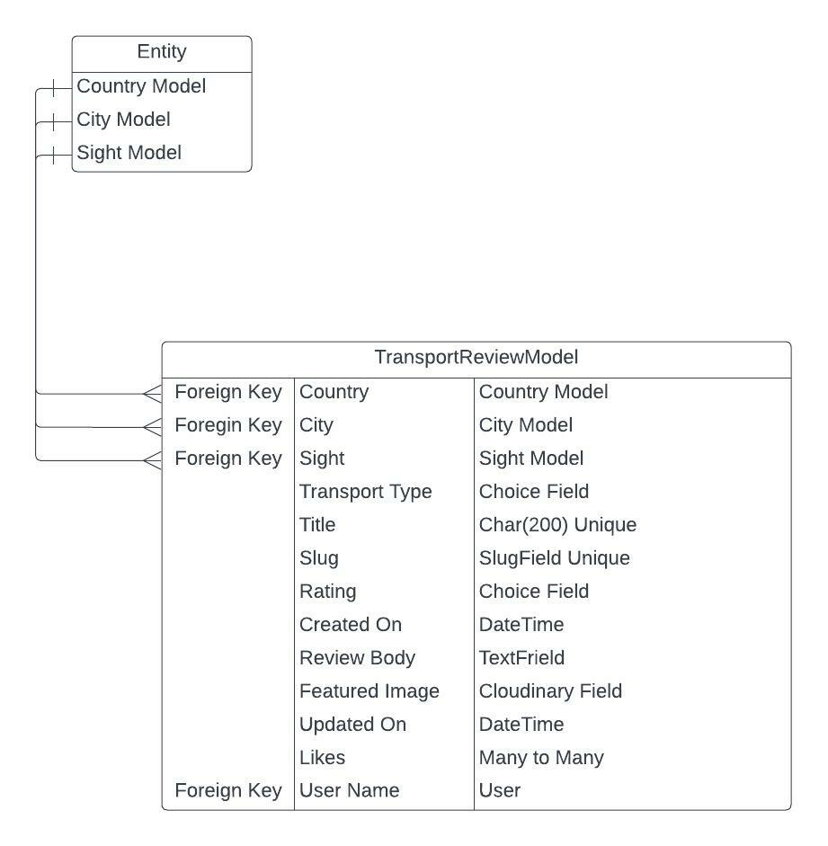
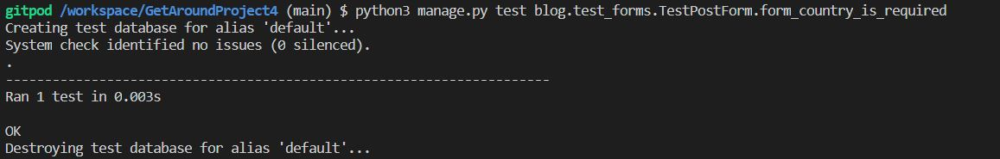

<h1 align=center> GetAround.ie </h1>

Travel like a local...   Locals know the best ways to get around our favourite cities, our site lets the locals rate their favourite transport routes to our favourite tourist sites!  

Live app link [here]()

## User Experience

### User Stories

As a user, I would like to: 

1. Register as a user. This will allow me to like other people's ratings, and to log my own ratings. 

2. Create a Review: share my own experiences including a photo if I have one, and a rating from 1 to 5 on the transport I used. 

3. Like other users posts

4. Navigate the site easily, in a familiar way

5. Search for reviews by the city I am visiting

As an administrator, I would like to: 

1. Be able to log in and view the admin panel

2. Be able to manage posts/reviews as required including editing and deleting. 

### 1. Strategy

  + **Project Goal**

   Create a platform that allows people (users) to share their experiences with local transport networks, and rate them from 1 to 5 stars. 

### 2. Scope

This project will cover the building of the basic application, including: 

- registration and authentication of users
- creating reviews
- liking reviews
- searching for reviews by city

## Functional Scope 

**GetAround DER - Diagram Entity Relationship**

**Agile Methodology**

SPRINTS
 

* Sprint 1

  + Setup Django 
  + Heroku Deployment 

* Sprint 2

  + Create Admin Panel & Superuser
  + Create the Add Country, Add City, Add Sight process through Admin
  + Create Index page with views of listed reviews 

* Sprint 3

  + Create Add Review
  + Set up Site Pagination
  + Create Login / Logout / Register pages

* Sprint 4

  + Set up Likes process

* Sprint 5

  + Amend the visual of the rating to show stars based on rating level

* Sprint 6

  + Create Search Bar
  + Amend CSS for branded styling

* Sprint 7

  + Create and manage final user tests
  + Final Deployment

### 3. Structure

* The site is clean and tidy, with easy to recognise navigation
* Once logged in, the nav bar updates accordingly
* Filtering with the search bar provides a smooth user experience

### 4. Skeleton

The wireframe for this project was created with Balsamiq:

### 5. Theme / Branding

* Colours

I created the background image myself using Procreate. I then pulled the colours from the background image to use throughout the site for continuity. 

  

* Font Selection
 
Font was chosen with [Google Fonts](https://fonts.google.com/) to be used across the website.

The most suited font for this project was Quicksand. 

## Existing Features

### **Navbar** 

If the user is logged in, the navbar will present the option to Create a Review, and to Log Out. 

If the user is NOT logged in, the navbar will present the option to Log In or to Register. 

+ The Navbar will collapse on mobile devices. 

### **Home Page**

The home page contains rows and columns which display cards. 

Each card contains the link to the relevant Review and Rating. 

The Card displays: 
The Featured Image (or placeholder as relevant)
The author
The title
The rating in stars
Created/Updated date
Number of likes
A link to read more

### **Review Details page** 

The Review Details page shows:
- The title
- The featured image
- The review body
- The rating in stars
- The like button 

## Future Features

I would like to ...

1. Add maps to the review details; so that you can load the transport option and location on GoogleMaps
2. Allow video uploads; so that users can share more details of the tranport method
3. Add a price field; so that you can filter the best transport options based on price. 
4. Allow Social Media login and sharing 

## Languages Used

Python 3.0

## Frameworks, Libraries & Programs Used

+ Balsamiq: Balsamiq was used to create the wireframes during the design process.
+ Font Awesome: Font Awesome was used on all pages to add icons for aesthetic and UX purposes.
+ Git: Git was used for version control.
+ Google Fonts: Google fonts are used to add fonts for aesthetic and UX purposes.
+ Django
+ LucidChart for the ERD

## Testing and Code validation 

This project was tested using unittest. Manual testing was done also to ensure no User Errors were experienced. 

 

## Project Bugs and Solutions:

| Bugs              | Solutions |
| ---               | --------- |
| REMAINING FAILED TEST - Test_Models is failing with error message "model object has no attribute done" | Attempts to resolve this before submission time failed, but will continue until a resolution is found. 
|REMAINING BUG - PLACEHOLDER IMAGE | In the review_detail.html the placeholder image does not load. After discussion with Tutoring the recommendation was to change the model for the placeholder image and replace the word "placeholder" with the link to the image. However, since there is already data in the database and the project needs to be submitted, I have not replaced this code within the models to avoid any data corruption. This will be rectified at a later stage. 
| The background on the Rows was covering the body image | Change transparency of the row resolved the issue 
| Home link was not working | Consultation with Tutor Support showed me that there was a duplicate url, which was removed, and this resolved the issue. 
| Search Bar was bringing the user to "add post" function, rather than search results | Moving the url for the search function to above other urls which directed to "views" helped to resolve the issue. 
| 

Unfortunately I was unable to resolve the remaining failed test before submission. As tutoring hours were closed, I was unable to contact them for assistance. Attempts to get assistance on Slack failed, and stackoverflow didn't seem to have a resolution for this particular error. 

## Deployment 

This App is deployed using Heroku.

Heroku Deployment 

1. Login to Heroku

2. Create a new App

3. Update the Config Vars 
 

3. Deployment on Heroku

    3.1.  Navigate to the Deploy tab.
        
    3.2.  Choose the main branch to deploy and enable automatic deployment to build Heroku every time any changes are pushed on the repository.
        
    3.3 Click on manual deploy to build the App.  When complete, click on View to redirect to the live site. 
    

# Credits

## Media

+ All pictures and images used in this project are from [Unsplash](https://unsplash.com).

## Work based on other code

[Codemy](https://www.youtube.com/watch?v=AGtae4L5BbI) - Search Bar  
[Pyplane](https://www.youtube.com/channel/UCQtHyVB4O4Nwy1ff5qQnyRw) - Star rating tutorial used to develop transport rating feature.  
[CodeInstitute](https://www.codeinstitute.net) - Learning Material and module training videos. The initial template layouts were found using the "Think Therefore I blog" walkthrough project, but amended to suit this project. 
[Codegrepper.com](https://www.codegrepper.com/code-examples/python/django+SEARCH+IN+CLASS+BASED+VIEW) - Search Bar for a class based view

# Acknowledgements

+ All my fellow students on our Slack group - they have been hugely supportive and helpful. 
+ Tutoring @ CodeInstitute - a wonderful resource for when I was stuck along the way. I cannot thank them enough for their patience and support. 